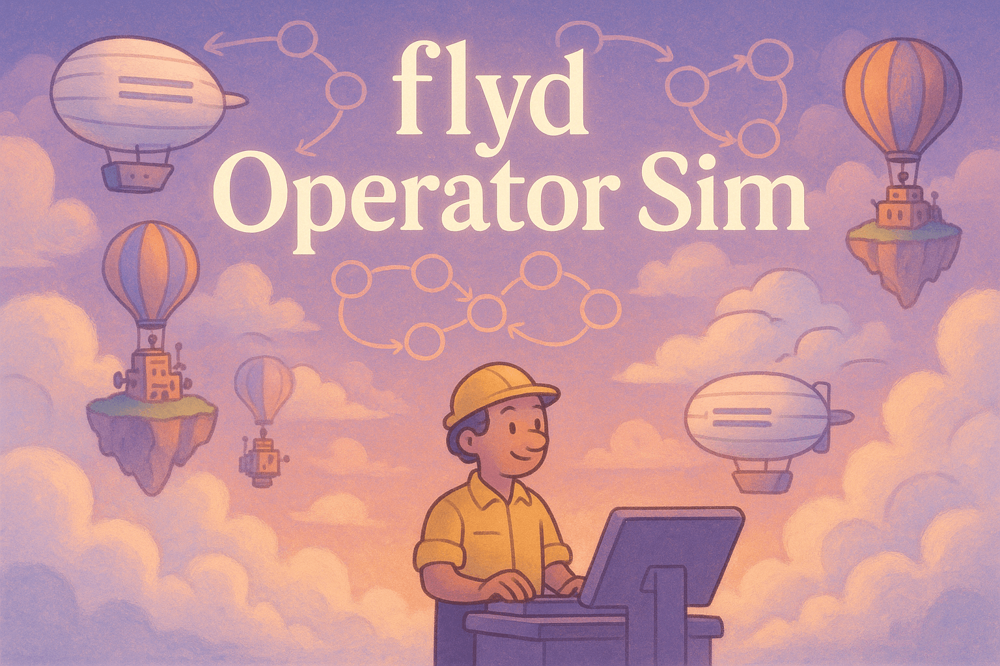

# flyd Operator Sim

A simulation game that puts you in the role of an on-call engineer responsible for maintaining the health and reliability of a Fly.io region. Manage flyd instances, FSM-driven operations, and respond to real-world operational challenges.



## Overview

flyd Operator Sim is an interactive educational tool designed to simulate the experience of operating and troubleshooting Fly.io's infrastructure. The simulation focuses on managing the health of worker nodes running flyd (Fly's daemon responsible for orchestrating machines) and responding to various incidents that can occur in a production environment.

### Key Features

- **Real-time Infrastructure Monitoring**: Monitor worker health, resource usage, and operational metrics
- **Incident Response**: Diagnose and resolve various types of infrastructure incidents
- **FSM Visualization**: See and understand Finite State Machine operations in action
- **Educational Gameplay**: Learn about distributed systems operations through hands-on simulation

## Getting Started

### Prerequisites

- Node.js 18+
- pnpm (recommended) or npm

### Installation

1. Clone the repository:

   ```bash
   git clone https://github.com/wSoltani/flyd-operator-sim.git
   cd flyd-operator-sim
   ```

2. Install dependencies:

   ```bash
   pnpm install
   # or
   npm install
   ```

3. Start the development server:

   ```bash
   pnpm dev
   # or
   npm run dev
   ```

4. Open [http://localhost:3000](http://localhost:3000) in your browser to start the simulation.

## How to Play

1. **Start the Simulation**: Click the "Start Simulation" button on the home screen.
2. **Monitor Worker Health**: Keep an eye on CPU, memory, disk usage, and other metrics.
3. **Respond to Incidents**: When incidents occur, investigate and resolve them using the available actions.
4. **Maintain Uptime**: Your goal is to maintain 99%+ uptime for 7 days of simulated time.

### Available Actions

- **Restart flyd**: Reset the flyd process when it becomes stalled or corrupted
- **Drain Worker**: Migrate all machines to other workers (useful for hardware issues)
- **Check containerd**: Inspect the health of the container runtime
- **Inspect LVM**: Check disk health and storage subsystem
- **Investigate Incident**: Gather more information about an incident
- **View flyd Logs**: Check logs for detailed error information
- **Force FSM Transition**: Attempt to force a stuck FSM to transition (risky)
- **Quick Fix**: Apply a quick fix to resolve an incident

## Game Mechanics

### Worker States

Workers can be in various states of health:

- **Healthy**: Operating normally
- **Degraded**: Experiencing issues but still functional
- **Critical**: Severe issues affecting operation
- **Offline**: Not operational

### Incident Types

The simulation includes various incident types:

- **flyd_stalled**: The flyd process becomes unresponsive
- **migration_stuck**: A machine migration operation gets stuck
- **containerd_sync**: Synchronization issues between flyd and containerd
- **network_partition**: Network connectivity issues
- **storage_corruption**: Storage subsystem corruption
- **memory_leak**: Memory leaks in the flyd process
- **disk_io_bottleneck**: Disk I/O performance issues
- **kernel_panic**: Kernel-level failures
- ...and many more

### Scoring

Your performance is evaluated based on:

- **Application Uptime**: Percentage of time applications were available
- **Successful Migrations**: Number of successful machine migrations
- **Failed Migrations**: Number of failed migration attempts
- **Risky Actions**: Number of high-risk actions taken

## Technology Stack

- **Next.js**: React framework for the frontend
- **TypeScript**: Type-safe JavaScript
- **Tailwind CSS**: Utility-first CSS framework
- **Radix UI**: Accessible component primitives
- **React Context**: For game state management

## Development

### Project Structure

```
/
├── app/                # Next.js app directory
├── components/         # React components
│   ├── ui/            # UI components
│   └── ...            # Game-specific components
├── hooks/             # Custom React hooks
├── lib/               # Utility functions
├── public/            # Static assets
└── styles/            # Global styles
```

### Building for Production

```bash
pnpm build
# or
npm run build
```

## Generated with qmims

This README was generated with [qmims](https://github.com/wSoltani/qmims), a tool that helps create professional documentation for your projects.

## Contributing

Contributions are welcome! Please feel free to submit a Pull Request.

## License

This project is licensed under the MIT License - see the LICENSE file for details.

## Acknowledgments

- Inspired by real-world operations at [Fly.io](https://fly.io)
- Built with [Next.js](https://nextjs.org/) and [Tailwind CSS](https://tailwindcss.com/)
